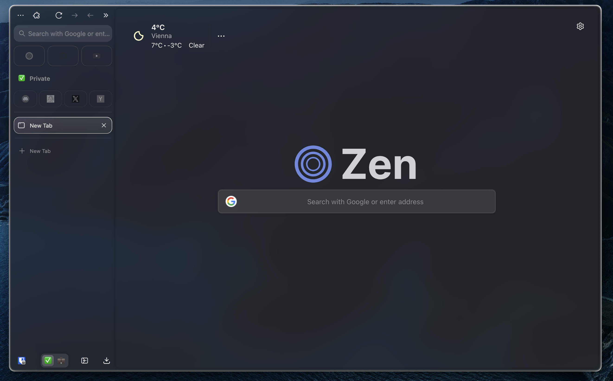
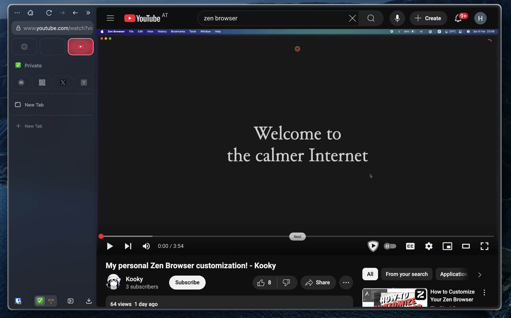
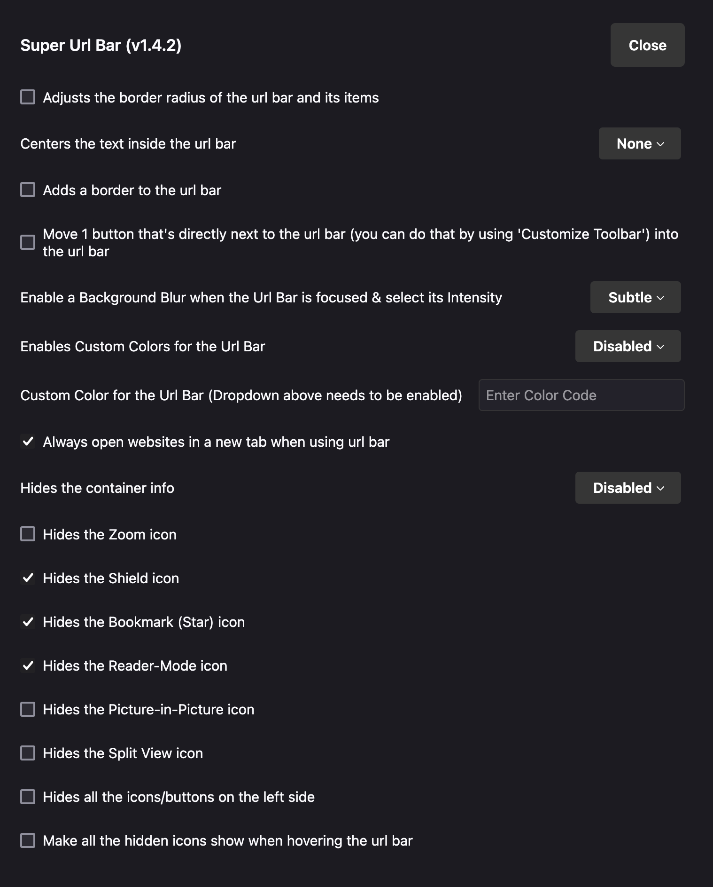
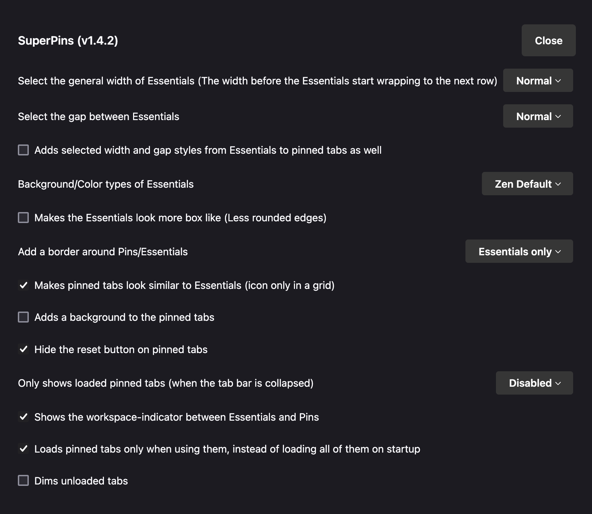

# Zen Theme

CSS Files / Settings / Zen Mods I use to theme my zen-browser




## Install CSS 

```bash
# install to your profile directory 
./install.sh 

# update natsumi before installing
./install.sh --update
```

### CSS Credits
- [natsumi-browser](https://github.com/greeeen-dev/natsumi-browser)
- [extensiosMenu.css](https://discord.com/channels/1088172780480114748/1281374861536526356/1337502917292326975)
- [newTab.css](https://discord.com/channels/1088172780480114748/1278814497917632552/threads/1317054453836415048)
- [swipeAnimation.css](https://github.com/sameerasw/zen-themes/tree/main/Zenimations)
- [shyToolbar.css](https://github.com/Naezr/zen-browser-css/blob/main/HiddenToolbar/shy-toolbar.css)
- [misc css from the zen discord](https://discord.com/channels/1088172780480114748)

## About:config settings

| Setting                                        | Value   |
|------------------------------------------------|---------|
| natsumi.findbar.wider-findbar                  | true    |
| natsumi.global.highlight-accent-color          | true    |
| natsumi.home.disabled                          | true    |
| natsumi.navbar.glass-effect                     | true    |
| natsumi.sidebar.blur-zen-sidebar               | true    |
| natsumi.sidebar.container-tabs-border          | true    |
| natsumi.sidebar.floating-panel                 | true    |
| natsumi.sidebar.panel-glass-effect             | true    |
| natsumi.sidebar.tabs-glass-effect              | true    |
| natsumi.sidebar.zen-sidebar-glass-effect       | true    |
| natsumi.theme.fullscreen-glass-effect          | true    |
|                                                |         |
| zen.theme.accent-color                         | #544a66 |
| zen.view.mac.show-three-dot-menu               | true    |
| zen.view.show-newtab-button-top                | false   |
| zen.theme.essentials-favicon-bg                | true    |
|                                                |         |
| browser.tabs.allow_transparent_browser         | true    |

## Zen Mods (and enabled mod settings if applicable)

- Better Unloaded Tabs
- Cleaner Extension Menu
- Floating Status Bar
- Hide Extension Name
- Hide Window Buttons
- Load Bar
- No Search Shortcut Icons
- No Sidebar Scrollbar
- Private Mode Highlighting
- Quietify
- Tab Preview Enhanced
- Super Url Bar

- Super Pins


## Stylebot 

Domain specific [stylebot](https://stylebot.dev/) css modifications for transparency/blur are in the [stylebot directory](/stylebot)

- [discord.com](/stylebot/discord.com.css)
- [github.com](/stylebot/github.com.css)
- [google.com](/stylebot/google.com.css)
- [instagram.com](/stylebot/instagram.com.css)
- [reddit.com](/stylebot/reddit.com.css)
- [x.com](/stylebot/x.com.css)
- [youtube.com](/stylebot/youtube.com.css)
- [zen-browser.app](/stylebot/zen-browser.app.css)

Credits go to [sameerasw](https://github.com/sameerasw/my-internet) for sharing his css styles